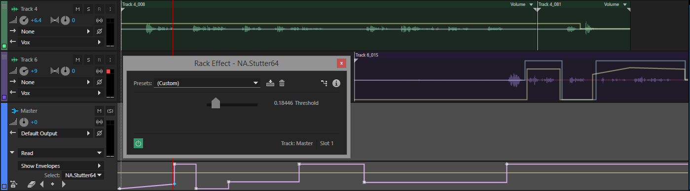

# StutterVst 
Audio plugin for adding randomized stutters based on a threshold.

For an effect that sounds simple enough, I was surprised since I couldn't find a single product that did this. 
Not in any DAW (Digital Audio Workstation) or any audio plugin that I could find. 
So I built it myself.

## Motivation
Tools on the market that can purposefully add stutters to audio in a similar way to this plugin aren't feasible for doing what this plugin does. 
Achieving multiple stutters would require many cumbersome, manual edits to set the position and delay of each stutter, 
whereas this plugin uses a simple threshold as its single parameter determining the frequency and the intensity of the stutters it adds. 

The threshold can be automated or changed in real time so certain parts of the audio can be more affected by this plugin than other parts.

## Demonstration

https://user-images.githubusercontent.com/5554478/122579110-9445cd00-d022-11eb-9b26-1e50ea17d83e.mp4

## Support
It's built with C# on the .Net Framework, using [Vst.Net](https://github.com/obiwanjacobi/vst.net) to interface with most audio editors. 
Any 32-bit or 64-bit editor that supports [VST](https://en.wikipedia.org/wiki/Virtual_Studio_Technology#VST_hosts) can use this plugin, 
however at this time [only Windows is supported](https://github.com/obiwanjacobi/vst.net/issues/14).

## Documentation
This project can be compiled with Visual Studio. 
Either pointing your audio editor to the project's output folder or copying them to the VST Plugins directory would allow you to use this plugin. 
[Plugin.cs](Plugin.cs) is the bridge between the [Audio Processor](AudioProcessor.cs) and the VST Host. 
See [Development.md](Development.md) for more development details.
